# 2022 IRC 暑期学校机器人组项目指导书

## 一、项目介绍

本专题旨在为学员介绍机器人路径规划问题，引导学员在提供的代码框架中实现经典的 RRT 算法系列算法，完成在 2D 地图中的路径规划问题。

教程分为环境配置篇，背景介绍篇，开发篇以及资料篇共

环境配置篇，我们将使用引导学员完成项目的基础环境配置。项目使用 Conda 进行环境管理并通使用 VSCode 作为开发工具

背景介绍篇，我们将简要介绍机器人路径规划以及本项目的主要目标 RRT 系列算法

开发篇，我们将具体介绍项目任务，引导学院完成 2D 路径规划算法实现并进行实验评价实现算法优劣。除最终效果外，我们更看重学员在完成项目过程中的表现，例如发现问题，思考并提出解决方案的能力，欢迎同学们尽可能多得完成布置任务并进行开放题的思考

资料篇，我们罗列了与项目相关的一些参考文献，如其它知名 2D 机器人路径规划算法。
鼓励大家在项目基础上实现其它 RRT 算法或非 RRT 路径规划算法，并与项目中所涉及的算法进行比较，提出自己的思考

项目以 Python 进行实现，其语法简单，极易上手。没有经验的同学可通过以下链接进行学习

- Python3 官方文档 https://docs.python.org/zh-cn/3/tutorial/index.html

- Python 入门 from CS231N https://cs231n.github.io/python-numpy-tutorial/

- Python 入门 from CS224N https://web.stanford.edu/class/cs224n/readings/cs224n-python-review.pdf

## 二、环境配置

本章节，我们将安装配置 Python 开发环境，IDE 及框架所需依赖、

我们以 conda 进行 Python 环境管理，并以 vscode 为例进行 IDE 配置

### Conda

Conda 是一个开源跨系统的环境管理软件，其支持 *Python, R, Ruby, Lua, Scala, Java, JavaScript, C/ C++,* 等多种语言。

我们将以 Conda 管理 Python 环境

#### 下载 Conda

通过以下链接登录 Conda 官网，并根据自己所使用系统安装对应版本 Conda 进行下载

https://docs.conda.io/en/latest/miniconda.html#system-requirements

- Windows: 选择 Miniconda3 Windows 64-bit
- macOS: 根据自己处理器选择 Miniconda3 macOS Intel x86 64-bit bash 或 Miniconda3 macOS Apple M1 64-bit bash
- Linux: 选择 Miniconda3 Linux 64-bit

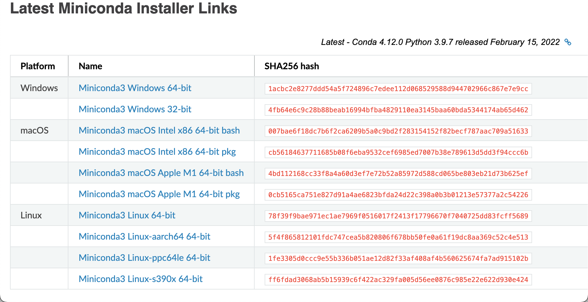

#### 安装 Conda

##### Windows

双击下载的 Miniconda3 Windows 64-bit.exe, 执行安装程序，全程除安装路径可自定义外，其余选项全部保持默认即可

一直点击下一步，直到完成安装

##### Linux/Mac

打开终端 (Terminal)，执行下载好的 .sh 文件并执行

```bash
bash Miniconda3-latest-xxxxx.sh
```

在下述页面时输入回车

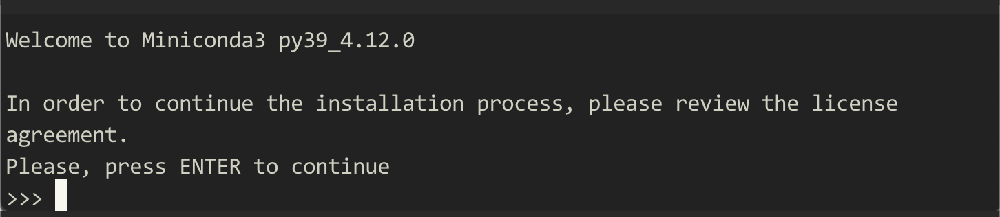


之后不断空格进行翻页 (Vim 语法)，直到出现下述页面，输入 yes 表示接受条款并回车

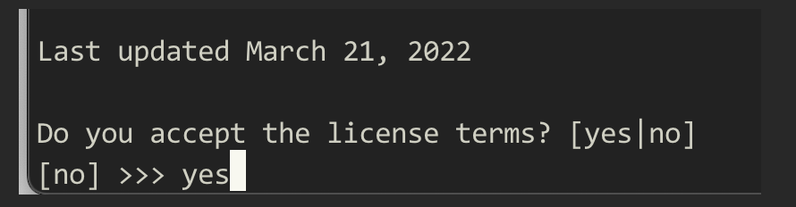

输入安装路径并回车（也可保持默认路径直接回车）, 等待安装完成

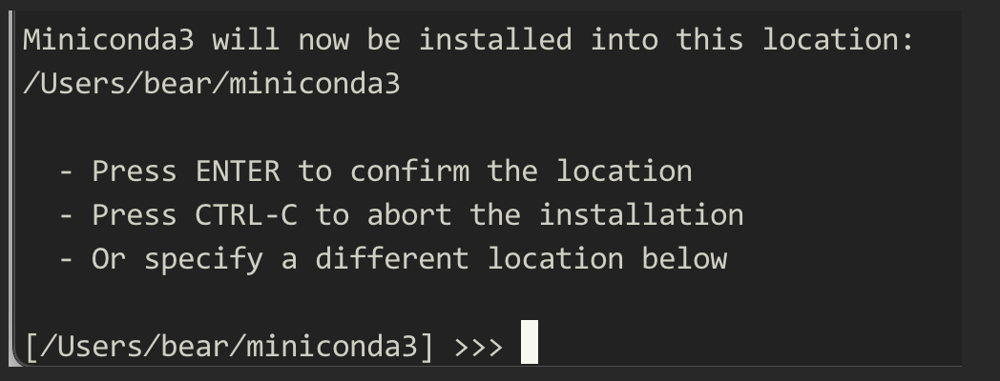

到最后一步，直接回车，完成 Conda 初始化结束安装
<center>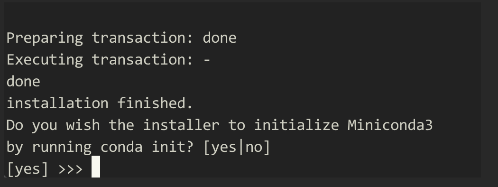</center>

###  VSCode

进入 VSCode 官网下载编辑器并完成安装

https://code.visualstudio.com/


安装完成后，打开 VSCode，点击左侧由多个 Cube 组成的图标进行插件下载


输入搜索 python, 安装如图所示的插件包完成 VSCode 配置


#### 使用 VSCode 运行项目 Demo

打开安装的 VSCode, 选择文件(File) -->打开文件夹(Open Folder)，浏览文件选择项目

#### 安装项目所需环境

从官方群中下载项目基础代码，并解压缩，进入项目路径 (使用 cd 命令进行目录切换. Windows 用户从开始菜单选择 Anaconda Prompt(Conda), Linux/Mac 用户直接使用终端)


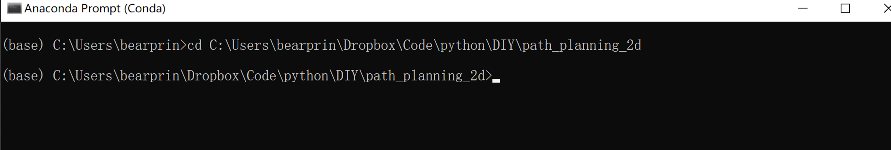


创建项目环境 

```bash
conda env create --file env.yml 
```

接下来，从左侧选择要运行的文件 (这里我们运行 baseline_rrt.py)，在右下角点击选择解释器，在弹出的选择框中选择刚刚安装的 IRC_DIY 环境

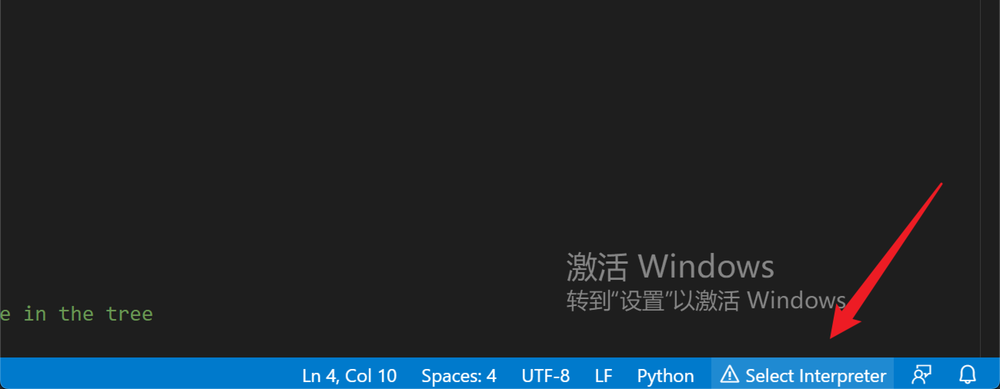

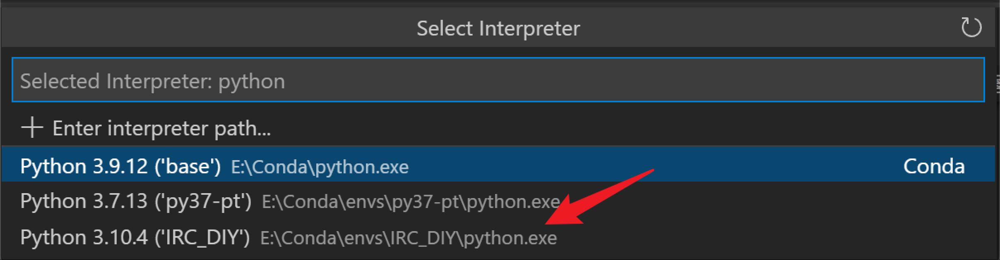

之后，点击右上角的 “播放键” 运行代码，基础代码开始进行规划并完成绘图

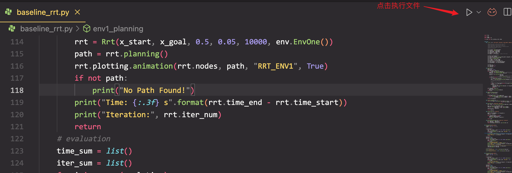

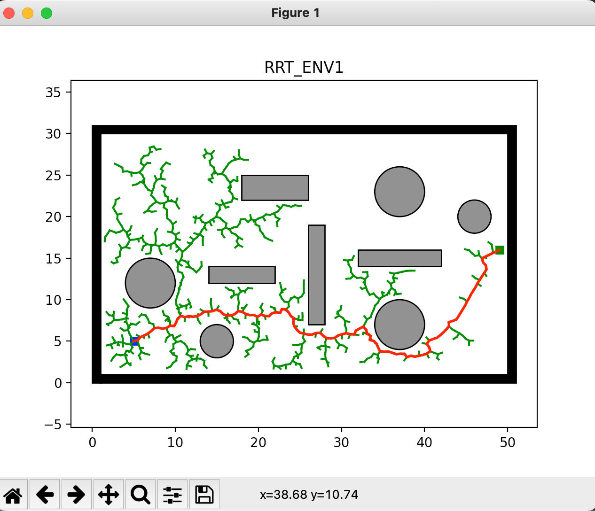

到此，环境配置完成

## 三、背景介绍

## 四、开发篇

该项目结构如下，其中 tool 文件夹内不需要改动，专注完成任务 1，任务 2，任务 3 所涉及到的 3 个文件即可

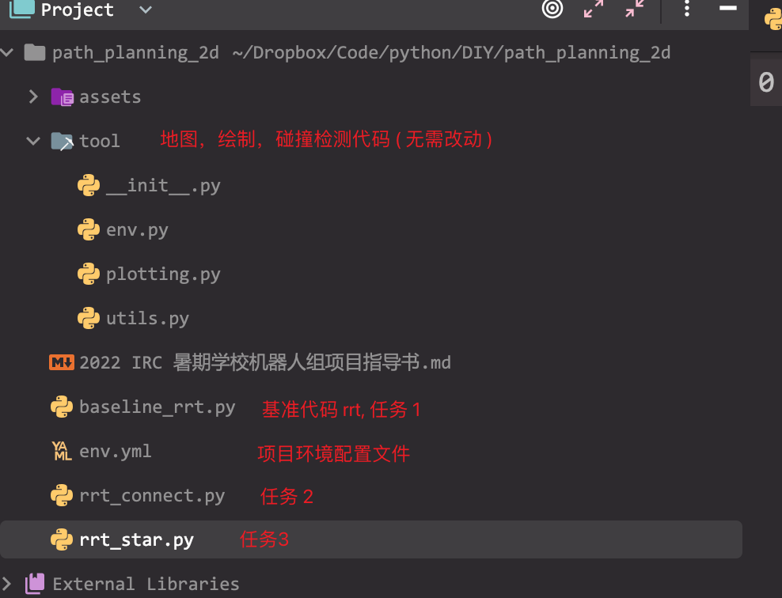

### 测试场景

我们准备了 3 个不同的场景方便同学们进行算法测试，其中蓝色点为起点，绿色点为目标终点

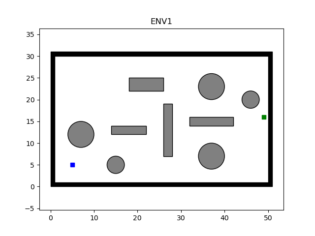


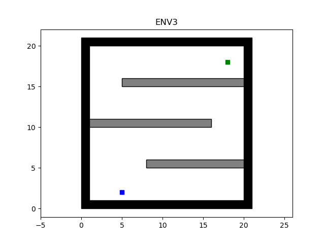

通过启动不同的函数，在不同环境中进行测试

- 其中当参数 eval_time == 1 时，会进行绘制命令并打印花费时间，迭代次数，路径长度
  - 建议同学们首先使用该配置进行算法调试
- 当参数 eval_time > 1 时，代码会统计多次规划的平均花费时间，平均迭代次数，路径长度
  - 最终同学们需要报告不同算法，不同参数在不同环境下运行 5 次的平均结果
  - 通过注释开启，关闭不同场景

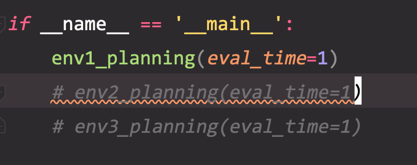

### 任务 1：RRT 算法

RRT 算法全称为 rapidly exploring random tree （快速随机探索树）

该算法基于采样思想，由起点为根结点构建一颗树，尽可能地对空间进行探索，最终找到一条使得起点与终点相连的树

RRT算法的优势在于无需对系统进行建模，无需对搜索区域进行几何划分，在搜索空间的覆盖率高，搜索的范围广，可以尽可能的探索未知区域。但是，由于基于采样该算法收敛较慢，且对于存在窄缝的场景效果较差

我们以原始 RRT 算法作为 baseline，并讲解相应代码

伪代码如下所示:

```
Algorithm RRT:
			 Input: start point st, end point ed
 	     Output: tree T
 	     
 	     T.init(st) // leverage st as the root node
 	     for iter = 1 to max_iter do
 					 x_rand = generate_random_node()
 					 x_near = find_nearest_node(x_rand, T)
 					 x_new = new_state(x_near, x_rand)
 					 if colision(x_near, x_new):
 					 		continue
 			 		 T.add_vertex(x_new)
           if not colision(x_new, ed):
           		 x_new = new_state(x_new, ed)
		           T.add_vertex(x_new)
		           T.add_vertex(ed)
		           break
return T
```

1. 在自由空间中随机采样得到采样点 $x_{rand}$
2. 从搜索树 $T$ 中找出距离采样点 $x_{rand}$ 最近的节点 $x_{near}$
3. 根据步长参数以及 $x_{rand}$ 与 $x_{near}$ 之间距离 ，产生新的拓展点 $x_{new}$
4. 如果 $x_{new}$ 和 $x_{near}$ 间存在直线通路（无碰撞）, 则将 $x_{new}$ 加入到搜索树 $T$ 中，且它的父节点为 $x_{near}$; 否则进入下一轮迭代
5. 若新加入的点 $x_{new}$ 与终点 ed 间距离小于步长且二者间不存在碰撞 (说明二者间可直线连接，已发现从起点到终点路径)，则最后添加终点到树中，算法终止

在 baseline_rrt.py 中，基本上是根据上述伪代码进行了实现并添加了注释，请同学们参照算法描述进一步理解代码，并完成相应任务

算法原始论文：http://msl.cs.illinois.edu/~lavalle/papers/Lav98c.pdf

CMU 课件：https://www.cs.cmu.edu/~maxim/classes/robotplanning_grad/lectures/RRT_16782_fall21.pdf

#### 任务 1.1 根据环境配置步骤，成功运行 RRT 算法(baseline_rrt.py)，并在三个环境中完成规划

请保存不同场景下的规划结果（图片，评价指标）

#### 任务 1.2 调整 RRT 算法参数（步长，随机采样拒绝率，最大迭代次数），在三个环境中获得比默认参数更少的时间，更少的迭代次数

由于不同机器配置问题，这里只提供 baseline 的迭代次数作为参考

请同学们充分理解算法，调整算法参数，获得比 baseline 更少的迭代次数，并报告相应参数及结果（设置 eval_time=5 获取平均时间，迭代次数，路径长度）

- Baseline
  - 环境 1:
    - 迭代次数 1449，路径长度 60.328
    
  - 环境 2:
    - 迭代次数 8285，路径长度 100.064
    
  - 环境 3:
    
    - 迭代次数 5728，路径长度 59.671

#### 任务 1.3 后处理，优化 RRT 产生的路径（开放题，可选）

RRT 算法得到的结果不一定是最优的，但我们可以用一个简单的启发式方法对路径进行一个小小的优化，去除一些无意义的点：

- 连接起点与终点，若二者间存在碰撞，则加入终点的上一步路径点
- 以上一个路径点为终点，继续进行判断，直到终点与起点间不存在碰撞

对于三个场景的结果，上述策略是否可以进一步优化路径? （路径长度降低）

### 任务 2：RRT-Connect 算法

在任务 1 中，我们认识到了 RRT 算法，并成功在三种不同场景中使用该算法完成了规划。由于 RRT 算法需要不停采样，采样效率对收敛速度有重要影响。而原始 RRT 只是基于起点生成单棵树进行采样，效率较低，特别是在 ENV3 这种存在狭窄通道的场景中

为此， Kuffner et.al [2000] 提出了 RRT-Connect 算法。该算法在RRT的基础上引入了双树扩展环节，即分别以起点和目标点为根节点生成两棵树进行双向扩展，当两棵树建立连接时可认为路径规划成功。

> TODO：增加算法描述，伪代码等资料（峰洋）

算法原始论文: https://www.cs.cmu.edu/afs/cs/academic/class/15494-s12/readings/kuffner_icra2000.pdf

CMU 课件：https://www.cs.cmu.edu/~maxim/classes/robotplanning_grad/lectures/RRT_16782_fall21.pdf

#### 任务 2.1 在 rrt_connect.py 文件中实现 RRT-Connect 算法

请同学们参照 baseline_rrt.py 中实现，完成 rrt-connect 算法

- self.V1 保存以起点为根节点的树
- self.V2 保存以终点为根结点的树

同学们可自己任意添加工具函数，并且可随意使用在 baseline_rrt.py 中已有函数

完成所有 TODO 任务，并将最终的路径保存于 path 列表中（从终点到起点顺序）

保存不同场景下的规划结果，与 RRT 算法进行比较

#### 任务 2.2 调整 RRT-Connect 算法参数，在三个环境中获得比 baseline 更少的时间以及迭代次数

如任务 1.1，请同学们充分理解算法，调整算法参数，获得比 baseline 更少的迭代次数， 并报告相应参数及结果（设置 eval_time=5 获取平均时间，迭代次数， 路径长度）

Baseline

- 环境 1:
  - 迭代次数 1400，路径长度 TODO
- 环境 2:
  - 迭代次数 2444，路径长度 TODO
- 环境 3:
  - 迭代次数 5722，路径长度 TODO

### 任务 3: RRT* 算法

尽管 RRT- Connect 大幅度提高了算法的收敛效率，但是由于其基于采样的方式，使得最终获得的路径并不一定收敛，路径也不一定最优（最短）

为此，在 2006 年，Karaman et al.[2006] 提出了 RRT* 算法，该算法主要流程与 RRT 一致，但做出了以下更改

- 更改最近点选择策略
即重新选择父节点：在新产生的节点 $x_{new}$ 附近以定义的半径范围内寻找“近邻”，作为替换 $x_{new}$ 父节点的备选。依次计算“近邻”节点到起点的路径代价加上 $x_{new}$ 到每个“近邻”的路径的代价，把代价最小的点作为新的父节点。
例如，如下图所示，搜索多个节点去作为new的父节点，看看通过哪个节点到达start最短。在本图中new-near-start是最短的，new-x1-near-start和new-x2-near-start均比第一条路长。

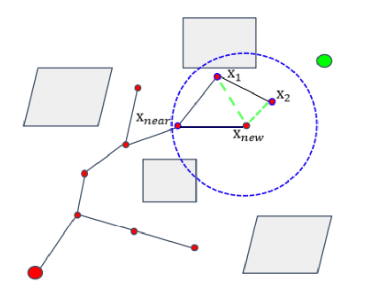

- 在加入新点后重新调整树的拓扑，降低 cost（距离）
如果近邻节点的父节点改为 $x_{new}$ 可以减小路径代价，则进行更改。
例如，如下图所示，对于x1来讲，start-near-x1比start-near-new-x1的距离短，所以x1的父节点是near，不用修改；对于x2来讲，start-near-x1-x2比start-near-new-x2的距离长，所以修改x2的父节点为new。

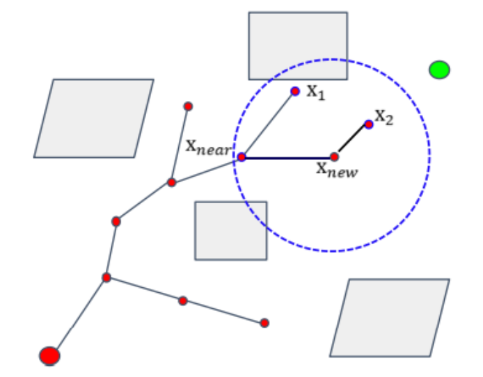


伪代码如下所示:

```
Algorithm RRT*:
			 Input: start point st, end point ed
 	     Output: tree T
 	     
 	     T.init(st) // leverage st as the root node
 	     for iter = 1 to max_iter do
 					 x_rand = generate_random_node()
 					 x_near = find_nearest_node(x_rand, T)
 					 x_new = new_state(x_near, x_rand)

           x_nearneighbor = findnear_neighbor(T, x_new, r)
           if obstaclefree(x_new, T, r) then
             T.Chooseparent(x_new, x_nearneighbor, T);
               for each x_nearneighbor calculate(dist(x_new, x_nearneighbor) + cost(x_nearneighbor, x_init))
               x_near-neighbor-mincost=min(dist(x_new,x_near-neighbor )+cost(x_near-neighbor, x_init))
               x_new_parent=x_near-neighbor-mincost
               return x_new_parent ;

             T.rewire(T,x_new, x_near_neighbor )
               for each x_near_neighbor calculate(dist(x_near_neighbor, x_new)+cost(x_new，x_init))
               x_new_mincost=min(dist(x_near_neighbor, x_new)+cost(x_new, x_init))
               x_near_neighbor_newparent=x_new_mincost
               return x_near_neighbor_newparent 

return T
```

1. 在自由空间中随机采样得到采样点 $x_{rand}$
2. 从搜索树 $T$ 中找出距离采样点 $x_{rand}$ 最近的节点 $x_{near}$
3. 根据步长参数以及 $x_{rand}$ 与 $x_{near}$ 之间距离 ，产生新的拓展点 $x_{new}$
4. 以 $x_{new}$ 更改父节点，并且重新进行拓扑操作
5. 上述两操作完成后进入下一轮迭代
6. 若新加入的点 $x_{new}$ 与终点 ed 间距离小于步长且二者间不存在碰撞 (说明二者间可直线连接，已发现从起点到终点路径)，则最后添加终点到树中，算法终止

虽然 RRT* 算法的路径结果更优，但是 RRT* 的收敛时间相应地也增长了不少

#### 任务 3.1  rrt_star.py 文件中实现 RRT* 算法

请同学们参照 baseline_rrt.py 中实现，完成 rrt*算法

同学们可自己任意添加工具函数，并且可随意使用在 baseline_rrt.py 中已有函数

完成所有 TODO 任务，并将最终的路径保存于 path 列表中（从终点到起点顺序）

保存不同场景下的规划结果，与另外两种算法进行比较

算法原始论文：https://people.eecs.berkeley.edu/~pabbeel/cs287-fa19/optreadings/rrtstar.pdf

CMU 课件：https://www.cs.cmu.edu/~maxim/classes/robotplanning_grad/lectures/RRT_16782_fall21.pdf

#### 任务 3.2 调整 RRT* 算法参数，在三个环境中获得比 baseline 更短的路径长度

如任务 1.1，任务 2.2，请调整参数，获得比 baseline 更优的算法

请同学们充分理解算法，调整算法参数，获得比 baseline 更短的路及ing长度迭代次数， 并报告相应参数及结果（设置 eval_time=5 获取平均时间，迭代次数）

Baseline（ TODO  )

- 环境 1:
  - 迭代次数 1400，路径长度 TODO
- 环境 2:
  - 迭代次数 2444，路径长度 TODO
- 环境 3:
  - 迭代次数 5722，路径长度 TODO

#### 任务 3.3 RRT* 算法的后处理（开放题，可选）

任务 1.3 中的策略对于 RRT* 算法结果是否有效？若无效，请简单讨论下无效原因

### 任务 4


